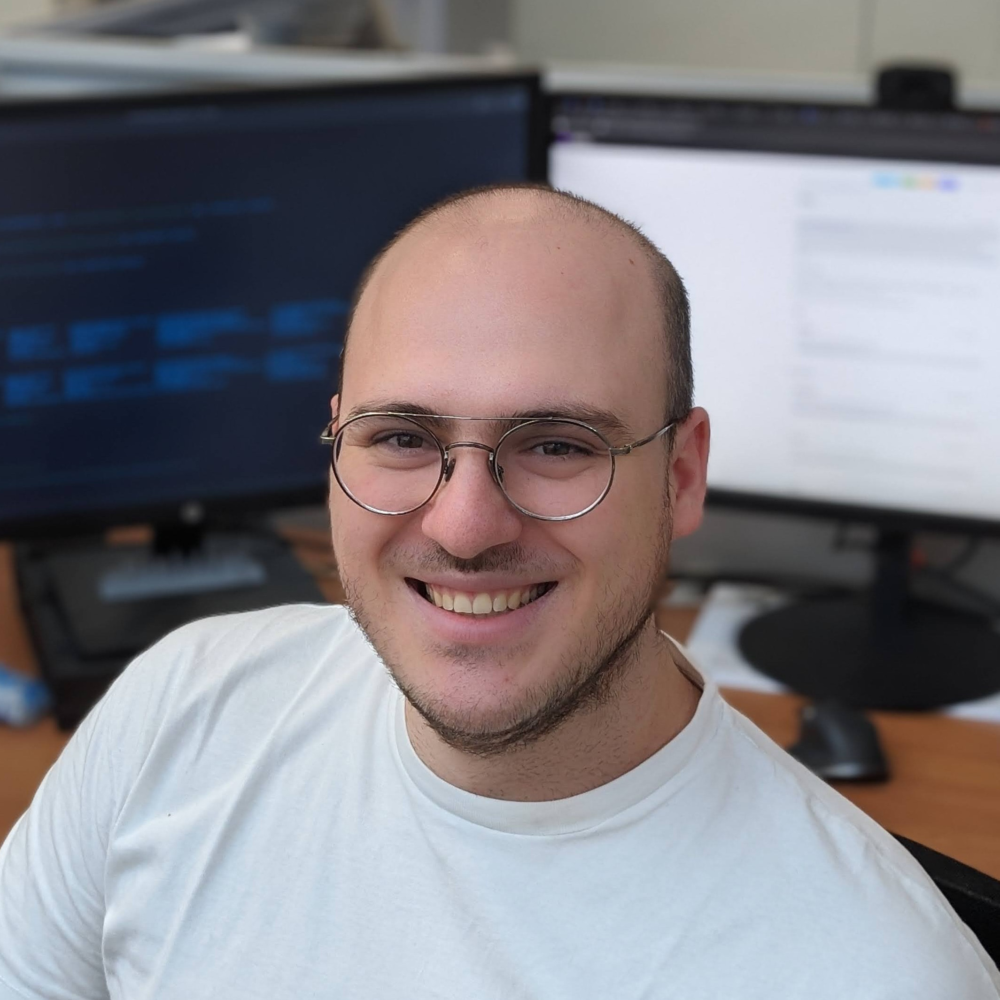

<!-- 

    

  -->

<table>
<tr>
<td width="35%" align="center">
 

</td>
<td width="65%" valign="top">

<h2> About Me</h2>

Researcher and software engineer with experience in aggregate computing, edge-cloud continuum, and open-source development. Published over 10 papers in international conferences and journals. Lead developer of multiple frameworks and platforms for distributed and embedded systems.

<h3> Skills</h3>

<ul>
<li>💻
High experience in <b>Scala</b>, <b>Kotlin</b>, <b>Java</b>, and <b>Rust</b>. Proficient in <b>JavaScript</b>, <b>TypeScript</b>, and <b>Python</b>
</li>
<li>🔧
Widely experienced with <b>Git</b>, <b>Gradle</b>, <b>GitHub Actions</b>
</li>
<li>🔌
Experience with embedded systems using <b>Raspberry Pi</b>, <b>Arduino</b>, <b>ESP32</b>, and <b>STM32</b>
</li>
<li>☁️
Experience with <b>Docker</b>, <b>Kubernetes</b>, <b>Portainer</b>, and <b>Proxmox</b>
</li>
</ul>

<h3> Contact</h3>

<ul>
<li>✉️ Email: <a href="mailto:nicolas.farabegoli@gmail.com">nicolas.farabegoli@gmail.com</a>
</li>
<li>💼 LinkedIn: <a href="https://linkedin.com/in/nfarabegoli">linkedin.com/in/nfarabegoli</a></li>
<!-- <li>🐦 Twitter: <a href="https://twitter.com/yourhandle">@yourhandle</a></li> -->
<li>🌐 Website: <a href="https://nicolasfarabegoli.it">nicolasfarabegoli.it</a></li>
</ul>

</td>
</tr>
</table>

 

